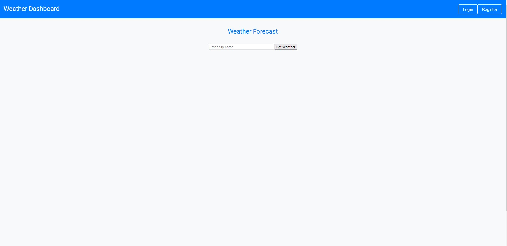
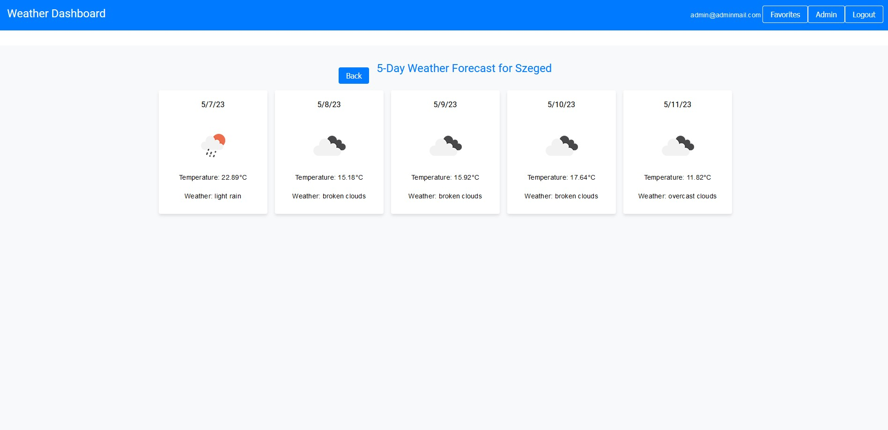
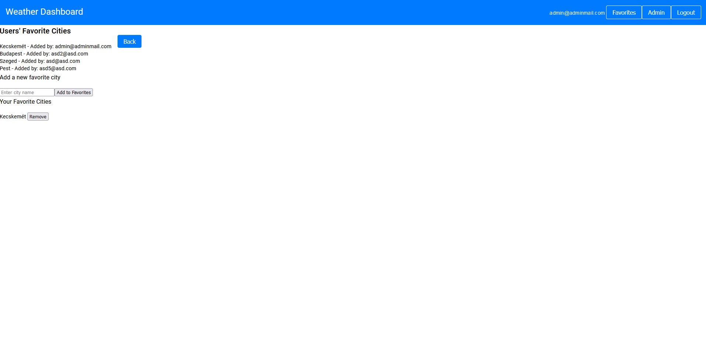
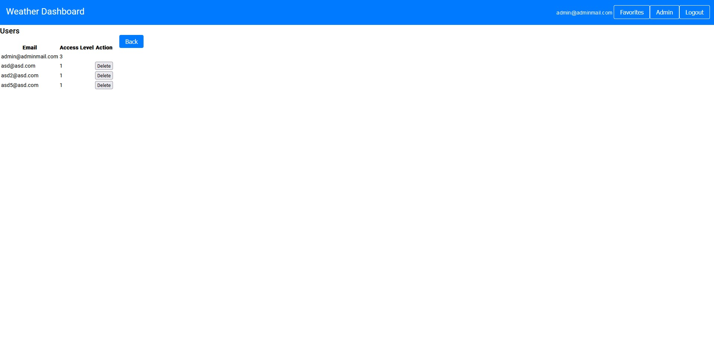

# ProgramrendszerekProjekt

## Indítás

1. Gyökérmappában "npm install"
2. .\server mappában "npm install"
3. .\angular/PRF mappában "npm install"
4. .\angular\PRF\src\app\environment.ts fájlba a WEATHER_API_KEY értékének a mellékelt API kulcs másolása (percenként 60 hívásos limit van rajta)
5. .\server "docker run --name weatherMongo -p 27017:27017 -v ./mongo: data/db -d mongo"
6. .\server mappában "node .\server\server.js"
7. .\angular/PRF mappában "ng serve"

Ezek után <http://localhost:4200> -on fog futni a frontend

## Projekt célja

Egyszerű városonkénti időjárás lekérése akár 5 napos előrejelzéssel.

## Használat

Indításkor a következő felület jelenik meg:

A login gombbal (jobb felső sarok) lehet bejelentkezni. Az adatbázihoz való kapcsolódásnál létrjött 3 db user account:

- (admin account) email: "admin@adminmail.com", pw: "admin123"
- (user account)  email: "asd@asd.com", pw: "asd"
- (user account)  email: "asd2@asd.com", pw: "asd

Az admin accounttal való bejelentkezés után, visszatér a home felületre, ahol egy szeged kártya fog megjelenni. Az input mezőben bármilyen városra rá tudunk keresni, a "Get Weather" gombbal hozzáadhatunk városokat a kezdőképernyőhöz, az utoljára megjelenített városok a következő bejelentezéskor is meg fognak jelenni. A város kártyákra kattintáskor egy másik felületre kerülünk, ahol 5 napos előrejezést láthatunk az adott várásról.

A "Back" gombbal tudunk visszalépni a kezdőképernyőre. A "Favorites" gombbal egy kedvencek felületre vezet, ahol láthatóak a  saját (és másik felhasználók)  kedvenc városai.

Amennyiben az admin accounttal vagyunk bejelentkezve, a jobb felső sarokban látható egy Admin gomb is, ami az admin oldalra visz. Itt kitörölehtünk bármely felhasználót, az Admin felhasználón kívül.

A "Register" gombbal új felhasználót is létrehozhatunk, de ezek alap, nem admin felhasználók lesznek.